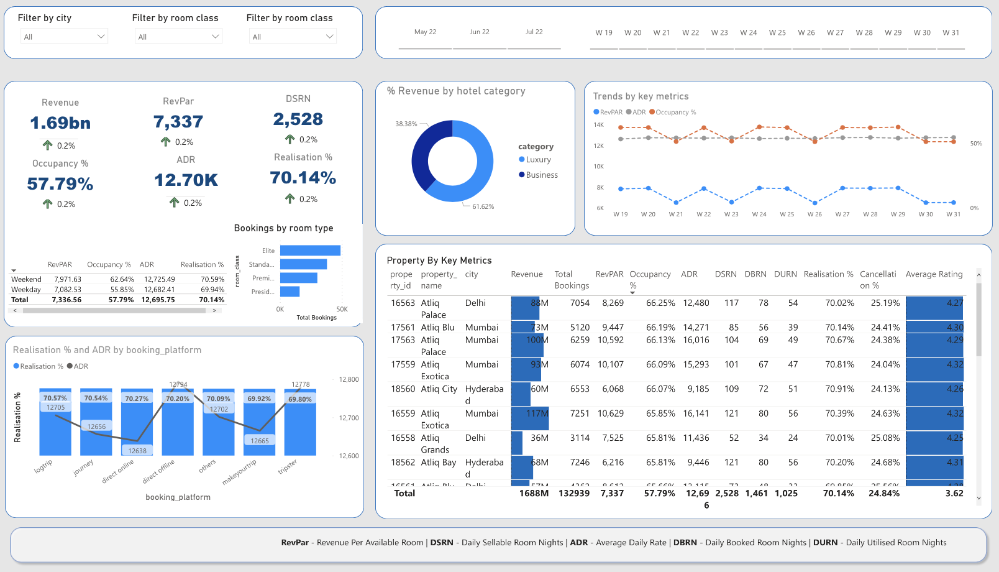

# Hotel booking Revenue analyses using PowerBI

In this data analyses project, I have examined the revenue performance of a hospitality chain. The following dashboard shows some key metrics such as,
- RevPar - Revenue per available room
- ADR - Average Daily Rate, It is the ratio of revenue to the total rooms booked/sold. It is the daily measure of the average sale of the paid rooms
- DSRN - Daily Sellable Room Nights
- Realisation - successful percentage of overall bookings that have "checked out"
- Occupancy - total successful bookings happened to the total available rooms available(capacity of the hotel)

And this implementation is available at following link: https://app.powerbi.com/links/Q31N43U-pw?ctid=16b68413-07dc-4196-98be-c60f51634c9d&pbi_source=linkShare

